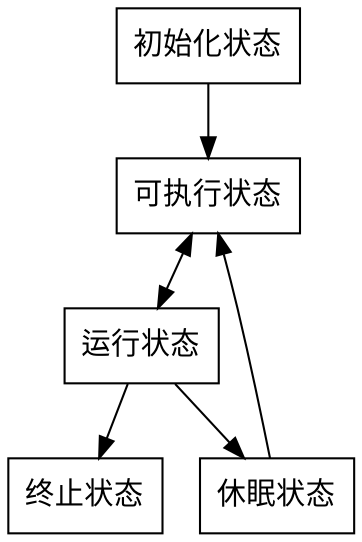
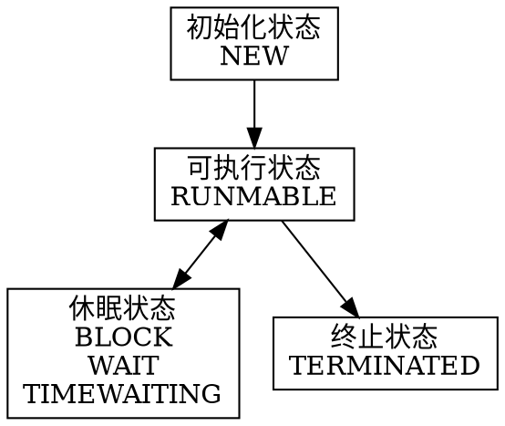

## java 并发基础
#### 线程

1. 通用线程生命周--线程状态
    - 初始状态 编程语言层面，线程已经已经创建，此时操作系统还没有创建线程，不允许分配cpu。
    - 可运行状态 操作系统已创建线程，可分配cpu状态
    - 运行状态 cpu空闲时，操作系统会分配cpu给一个可执行状态的线程，
    被分配cpu执行的线程为运行状态
    - 休眠状态 调用一个阻塞api(读文件)或者等待条件变量，让出cpu使用权，休眠状态的线程永远不能获得cpu的使用权除非转换为可执行状态。
    - 终止状态 程序正常结束，未捕获异常出现，终止状态线程生命周期结束。

2. java线程状态
    - NEW (新创建状态，new Thread(r) 此时就处于new状态，在执行前准备的状态？？此时操作系统还没有创建线程)
    - RUNMABLE (可运行状态) 新创建的线程调用start的就处于该状态，此时线程可能运行也可能没有运行，依赖于，操作系统有没有分配cpu给该线程。
    - block，wait和timewaiting (阻塞和等待状态) 都是暂时不活动，他们区别在于进入该不活动状态的方式不用，wait 等待通知，block等待资源(说的不够清楚需要修改 TODO )  获取锁，等待的计时版本。
    - terminated 终止状态 两种情况进入该状态 程序正常结束或出现未捕获异常。

3. 通用线程状态与java线程状态对应

4. java支持线程安全的方法
    - 可重入锁 ReentrantLock() 锁lock, 解锁unlock
    - 条件变量 Condition,await,signalall,signal
    - synchronized,wait(xxx),notify(),notifyall()
    - trylock trylock(long time, TimeUnit unit) lockInterruptibly() await(long time, TimeUnit unit) awaitUninterruptibly()

问题1：等待条件线程被唤醒并重新获取锁后 从程序那个位置开始执行？
从wait返回，此时条件可能满足也可能不满足，（比如转账操作，用户转入后就会调用唤醒等待该条件的所有线程，但如果转入的钱比刚刚唤醒的转出线程所需的钱少时就是不满足条件情况）所以有必要重新检查该条件 范式 while（检查条件不满足）{等待条件}
问题2：为什么推荐signalall而不推荐signal？
当一个条件被改变时（此时可能满足一些等待的条件线程）signalall可通知等待该条件的**所有**线程（换句话说这里面一定有你想要通知的线程），让他们通过竞争来访问对象，这样大大提高了，等待条件线程的执行成功率。反之用signal**随机选出一个唤醒**（因为随机就导致唤醒的未必一定是满足条件的，或者说未必是你想要唤醒的），如果不满足他将继续阻塞，而其他等待线程也没有被唤醒执行的机会，如果以后在没有发送signal的线程则这些等待线程将永久阻塞
问题3：synchronized关键字与lock和condition的区别和关系？
原理是相同，使用lock对象保证同一时刻只有一个线程进入被保护代码块，锁对象同时管理着试图进入被保护代码块的线程，一个锁对象可以有一个或多个条件对象，每个条件对象管理进入被保护代码区但不能执行的线程。 synchronized关键字基于每个对象或类所拥有的内部锁，并且使其只有一个条件变量，目的方便程序设计者更方便使用。因为只有一个条件变量所以直接调用wait方法和notifyall，notigy（不用区分等待那个条件，因为只有一个条件）synchronized的一些局限

 - 不能中断视图获取锁的线程？
 - 试图获取锁不能设置超时
 - 每个所只能有一个条件
问题4：那么使用lock和condition还是使用synchronized关键字呢？
  最好两个都不使用，使用juc中的线程安全机制，如果真的有需要优先使用synchronized，最后考虑lock，这样减少出错的概率。
  
问题5：trylock和lock的区别，trylcok非阻塞枷锁（没有获取到锁会直接返回不会阻塞进入等待队列）lock在获取不到锁的时候回进入阻塞，当阻塞进程被中断那么中断线程在获取到锁之前会一直阻塞，如果死锁则lock无法结束（所以lock无法被中断）
trylock trylock(long time, TimeUnit unit) 如果未获取到锁会阻塞到指定时间然后返回，如果在阻塞期间被中断会抛出异常，（结束程序）（trylock是可被中断的）。
