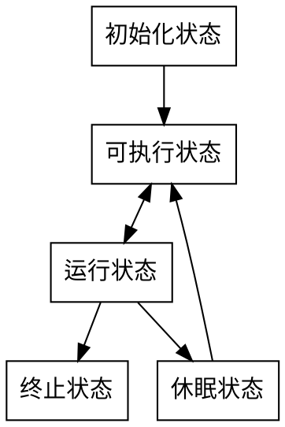
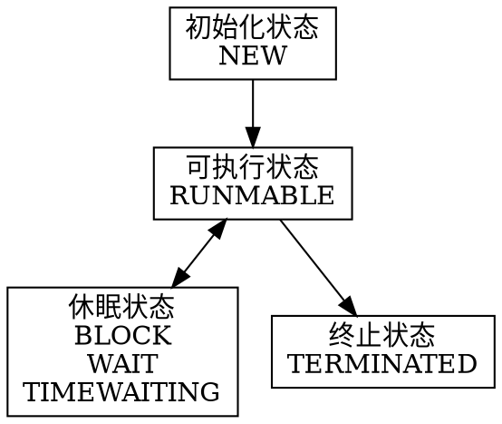

# java并发基础

## 学习java并发

1. 理论模型管程
2. 需要解决的问题 分工，同步，互斥（可见性，有序性，原子操作，内存模型用例解决可见性和有序性）
3. 将学习的知识向上面归类

### 并发bug产生的源头

1. 起源由于cpu，内存，io之前的读写速度差异很大，为提高各个模块性能，引入cpu缓存平衡cpu和内存的访问速度差，操作分时复用平衡了cpu与io的速度差，编译器优化程序指令的顺序使其更加合理使用缓存
2. 天下没有免费的午餐，上面的机制提高了性能的同时也带来了很多bug，cpu缓存带来可见性问题，线程分时复用导致原子性问题，编译器优化导致有序性问题。
3. 如何解决这些问题-内存模型（内存模型规范了jvm按需禁用缓存和编译优化）
4. volatile （直接写入内存，直接从内存中读取，禁用cpu缓存）

```java
// 以下代码来源于【参考 1】
class VolatileExample {
  int x = 0;
  volatile boolean v = false;
  public void writer() {
    x = 42;
    v = true;
  }
  public void reader() {
    if (v == true) {
      // 这里 x 会是多少呢？
    }
  }
}
```

#### java内存模型之happens before规则(解决可见性和有序性)

1. 程序顺序规则 (在一个线程中，按照顺序，前面的操作happens before 后面的操作)
2. volatile变量操作（对volatile类型变量的写操作happens before 后续对该变量的读操作）
3. 传递性规则 (A happens before B， B happens before C 那么 A happens before C)

- 所以根据这规则1 线程一写操作中x=42，happens before v=ture ，根据规则2 线程一的true happens before 线程二读操作 v==ture 再根据规则3 所以x=42对于线程二读操作中的x是可见的。

1. 管程中的锁的规则(解锁操作happens before 对这个锁的加锁操作)。
2. 线程的start()规则(主线程A调start()启动子线程B,start() happens before B)。
3. 线程的join()规则(主线程A join 子线程B，B happens before join)。
4. 引申一下，关联关系像原子性特征一样。
5. 原子性的本职中间操作对外不可见。

#### 互斥锁(解决原子性问题)

1. 重点注意锁和要保护资源的对应关系，自己的锁保护自己的资源，可以类比现实生活中的收门票，锁和要保护资源的关系是一对多关系。
2. 资源与资源之间没有关联关系时，各自用各自的锁这也叫细粒度锁，可以提高效率。
3. 一把锁保护多个资源时，要注意锁一定得覆盖锁定要保护的资源，例如转账的例子，如果用this作为锁，只等保护本账户不能保护目标账户，再例如A转账B，B转账C的例子。

#### 死锁

1. 一把锁保护多个有关联关系的资源即用粗力度锁会导致性能严重下降，在现实场景中是不可接受的，所以还是要使用细粒度锁来提高性能，但使用是要注意避免死锁。
2. 例如银行转账的例子，程序设计为同时获取A和目标B的锁成功后进行操作，如果两个线程同时执行，一个获取了A，等待B另一个获取了B等待A，就造成了死锁。
3. 死锁出现需满足四个条件
   1. 互斥，共享资源X和Y只能被一个线程占有
   2. 占有且等待，线程T1获取了X资源的同时，等待共享资源Y时，不释放X。
   3. 其他线程不可抢占T1占有的资源。
   4. 循环等待，T1等待T2占有的资源，T2等待T1占有的资源。
   5. 破坏234条就能避免死锁。2，一次性获取所有资源，3，占用部分资源的线程进一步申请资源，申请不到的时候释放锁占有的其他资源。4，顺序获取资源。

#### 通知等待机制

1. 对标管程模型，理解synchronized 的 wait notify,notifyall 方法。sleep和wait的区别。

#### 线程

1. 通用线程生命周--线程状态
    - 初始状态 编程语言层面，线程已经已经创建，此时操作系统还没有创建线程，不允许分配cpu。
    - 可运行状态 操作系统已创建线程，可分配cpu状态
    - 运行状态 cpu空闲时，操作系统会分配cpu给一个可执行状态的线程，
    被分配cpu执行的线程为运行状态
    - 休眠状态 调用一个阻塞api(读文件)或者等待条件变量，让出cpu使用权，休眠状态的线程永远不能获得cpu的使用权除非转换为可执行状态。
    - 终止状态 程序正常结束，未捕获异常出现，终止状态线程生命周期结束。



2. java线程状态
    - NEW (新创建状态，new Thread(r) 此时就处于new状态，在执行前准备的状态？？此时操作系统还没有创建线程)
    - RUNMABLE (可运行状态) 新创建的线程调用start的就处于该状态，此时线程可能运行也可能没有运行，依赖于，操作系统有没有分配cpu给该线程。
    - block，wait和timewaiting (阻塞和等待状态) 都是暂时不活动，他们区别在于进入该不活动状态的方式不用，wait 等待通知，block等待资源(说的不够清楚需要修改 TODO )  获取锁，等待的计时版本。
    - terminated 终止状态 两种情况进入该状态 程序正常结束或出现未捕获异常。

3. 通用线程状态与java线程状态对应



4. java支持线程安全的方法
    - 可重入锁 ReentrantLock() 锁lock, 解锁unlock
    - 条件变量 Condition,await,signalall,signal
    - synchronized,wait(xxx),notify(),notifyall()
    - trylock trylock(long time, TimeUnit unit) lockInterruptibly() await(long time, TimeUnit unit) awaitUninterruptibly() 
    - 读写锁private ReentrantReadWriteLock rwl = new ReentrantReadWriteLock() private Lock readLock = rwl . readLock() ;private Lock writeLock = rwl .writeLock();
    - stop和resume被过期的方法

问题1：等待条件线程被唤醒并重新获取锁后 从程序那个位置开始执行？
从wait返回，此时条件可能满足也可能不满足，（比如转账操作，用户转入后就会调用唤醒等待该条件的所有线程，但如果转入的钱比刚刚唤醒的转出线程所需的钱少时就是不满足条件情况）所以有必要重新检查该条件 范式 while（检查条件不满足）{等待条件}
问题2：为什么推荐signalall而不推荐signal？
当一个条件被改变时（此时可能满足一些等待的条件线程）signalall可通知等待该条件的**所有**线程（换句话说这里面一定有你想要通知的线程），让他们通过竞争来访问对象，这样大大提高了，等待条件线程的执行成功率。反之用signal**随机选出一个唤醒**（因为随机就导致唤醒的未必一定是满足条件的，或者说未必是你想要唤醒的），如果不满足他将继续阻塞，而其他等待线程也没有被唤醒执行的机会，如果以后在没有发送signal的线程则这些等待线程将永久阻塞
问题3：synchronized关键字与lock和condition的区别和关系？
原理是相同，使用lock对象保证同一时刻只有一个线程进入被保护代码块，锁对象同时管理着试图进入被保护代码块的线程，一个锁对象可以有一个或多个条件对象，每个条件对象管理进入被保护代码区但不能执行的线程。 synchronized关键字基于每个对象或类所拥有的内部锁，并且使其只有一个条件变量，目的方便程序设计者更方便使用。因为只有一个条件变量所以直接调用wait方法和notifyall，notigy（不用区分等待那个条件，因为只有一个条件）synchronized的一些局限

 - 不能中断视图获取锁的线程？
 - 试图获取锁不能设置超时
 - 每个所只能有一个条件
问题4：那么使用lock和condition还是使用synchronized关键字呢？
  最好两个都不使用，使用juc中的线程安全机制，如果真的有需要优先使用synchronized，最后考虑lock，这样减少出错的概率。
  
问题5：trylock和lock的区别，trylcok非阻塞枷锁（没有获取到锁会直接返回不会阻塞进入等待队列）lock在获取不到锁的时候回进入阻塞，当阻塞进程被中断那么中断线程在获取到锁之前会一直阻塞，如果死锁则lock无法结束（所以lock无法被中断）
trylock trylock(long time, TimeUnit unit) 如果未获取到锁会阻塞到指定时间然后返回，如果在阻塞期间被中断会抛出异常，（结束程序）（trylock是可被中断的）。
中断线程主线程拿到要中断线程的的对象调用中断方法thread.interrupt();
问题6 stop和resume方法被淘汰的原因，stop在程序任何时段调用会立即终止所有未结束的方法（比如转账a账户已扣款b还未入账b账户之间调用stop就会造成影响）resume 的问题是 当挂起的线程持有一把锁，而这把锁resume时候也要获取那么则造成了死锁。